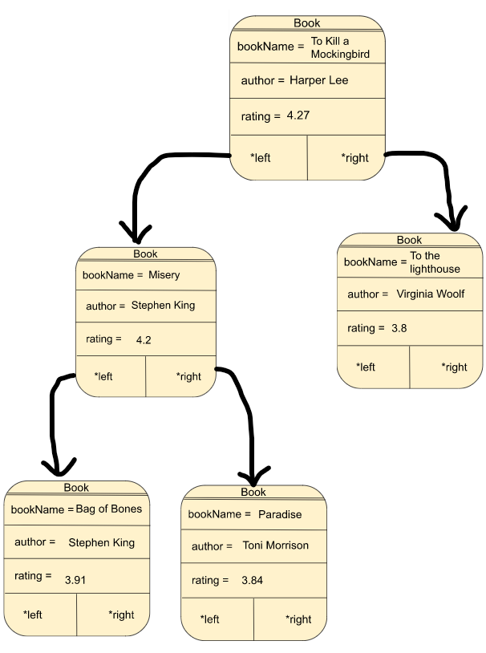
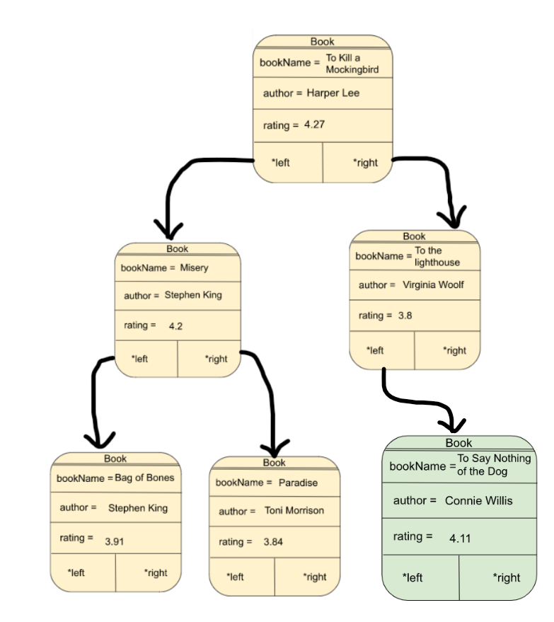
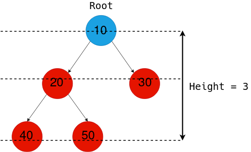

# CSCI 2270 – Data Structures - Assignment 6 - Binary Search Tree

## Objectives

1. Build a binary search tree (BST)
2. Traverse, Search and Insert in a BST

## Instructions to run programs

Please read all the directions ​*before* writing code, as this write-up contains specific requirements for how the code should be written.

To receive credit for your code, you will need to pass the necessary test cases. Use the following steps to test your code as you work on the assignment:

 1. Open up your Linux terminal, navigate to the build directory of this assignment (e.g. `cd build`).
 2. Run the `cmake ..` command.
 3. Run the `make` command.
 4. If there are no compilation errors, two executables will be generated within the build directory: `run_app` and `run_tests`.
 4. If you would like to run your program, execute `run_app` from the terminal by typing `./run_app <Any Required Arguments>`.
 5. To run the grading tests, execute `run_tests` from the terminal by typing `./run_tests`.

## Background 

Binary Search Trees (BST) are very interesting data structures. Let's break down what they mean.

    1. Tree: A tree is a hierarchical data structure. Every node has zero or more children (where each child is also a node of the tree). It starts with a root node (start of the tree) and branches out to the leaf nodes(have no children).

    
    2. Binary: While a tree node can have any number of children, making it binary restricts the children to atmost 2. (So a node in a binary tree can have 0, 1 or 2 children only)


    3. Search: This is what makes a BST unique. BSTs have some rules in place which allow us to 'search' faster in our tree data structure. Let's look at these rules which must be honored by every node of a BST.
    (a) Each BST node must be associated with a key. This key could be an integer, string, float, etc.
    (b) For each node of the BST, ALL nodes in the left subtree must have key 'lesser' than the key of the node.
    (c) For each node of the BST, ALL nodes in the right subtree must have key 'greater' than the key of the node.
    (d) For this assignment, no two books have the same `bookName`.


 ## Overview
 
 In this assignment, you should store the information of some books in a binary search tree. For each book, we will store its name, author, and rating. A sample dataset from [Goodreads](https://www.goodreads.com/) has been given in `books.csv`. This is the definition of the `Book` struct in `BookCollection.hpp`:
```
 struct Book {
    string bookName;
    string author;
    double rating;

    Book* left = nullptr;
    Book* right = nullptr;
};
```
The tree is such that all the children of a node on its left child's subtree have `bookName` alphabetically `smaller` than the parent node. Similarly, the children on the right subtree are alphabetically `larger`.

You can use the `books.csv` file to test the functions, but you can run the program without it as well. If you want to use the dataset, simply add `../books.csv` as an argument to `run_app`. You don't need to do this, and simply running it without any arguments will also work, but will start with an empty collection. 

Here are a few entries from the dataset:


| Name | Author | Rating
| --- | --- | --- |
| To Kill a Mockingbird | Harper Lee | 4.27 |
| Misery | Stephen King | 4.2 |
| To the Lighthouse | Virginia Woolf | 3.8 |
| Paradise | Toni Morrison | 3.84 |
| Bag of Bones | Stephen King | 3.91 |

If we add these items in the given order, the tree should be as follows: 

```Example 1```



**NOTE:** `app/main.cpp` file has been provided for you. Do NOT make any changes to the `app/main.cpp` file). For the described setting, you will have to implement the following functions in `code/BookCollection.cpp`. 

### Constructor: BookCollection()
Class constructor. Set the root of the tree to a `nullptr`.

### Destructor: ~BookCollection()
Class destructor. Free all memory that was allocated and set root to `nullptr`. 

For any book present in the collection, you need to recursively delete both the children and only then delete the current book. If you delete the current book first, `book->left` and `book->right` will become inaccessible.

### void addBook(string bookName, string author, double rating)

Add a new book to the collection based on the `bookName`. You should create a new `book`, initialize it with the given information (bookName, author and rating), and add it to the tree. Your tree should still be a valid Binary Search Tree after the insertion. 

*Hint: you can compare strings with `<`, `>`, `==`, `string::compare()` function.*

**NOTE:** No two books have the same `bookName`.

#### ```Example:```

If in the ```Example 1``` we add a new book by calling the addBook function as follows:


```
addBook("To Say Nothing of the Dog", "Connie Willis", 4.11);
```

The updated BST should look like:

```Example 2```




### showBookCollection() 

Show all the books added to the collection so far, in alphabetical order. You can use the following line of code to print all the information:

```
cout << "BOOK: " << book->bookName << " BY: " << book->author << " RATING: " << book->rating << endl;
```

For ```Example 2``` above, you should print: 

```
BOOK: Bag of Bones BY: Stephen King RATING: 3.91
BOOK: Misery BY: Stephen King RATING: 4.2
BOOK: Paradise BY: Toni Morrison RATING: 3.84
BOOK: To Kill a Mockingbird BY: Harper Lee RATING: 4.27
BOOK: To Say Nothing of the Dog BY: Connie Willis RATING: 4.11
BOOK: To the Lighthouse BY: Virginia Woolf RATING: 3.8
```
If the collection is empty, print `cout << "Collection is empty." << endl;`

*Hint: to traverse the tree in alphabetical order, for every node you need to first print all its descendents in the left subtree, then print the node itself, and then every descendent in the right subtree.*


### void showBook(string bookName)

In the `BookCollection`, search for a `bookName` matching the given `bookName`. If the book is found, display its properties:

```
cout << "Book:" << endl;
cout << "==================" << endl;
cout << "Name :" << book->bookName << endl;
cout << "Author :" << book->author << endl;
cout << "Rating :" << book->rating << endl;
```
If the book is not found in the collection, print `cout << "Book not found." << endl;`

*Hint: You should utilize the properties of a Binary Search Tree, so that the search time is limited to O(log n). Starting from the root, at every node, if it doesn't match the given title, you shoud either choose to traverse the left subtree or the right subtree.*

#### ```Example:```

If in the ```Example 2``` we search using the following command: 


```
showBook("Paradise");
```

You should output:
```
Book:
==================
Name :Paradise
Author :Toni Morrison
Rating :3.84
```

If you search for:

```
showBook("Flatland");
```

You should output:

```
Book not found.
```


### void showBooksByAuthor(string author)
The objective of this method is to print the `bookName` (and `rating`) for ALL the books by a particular author. The booknames should be alphabetically printed.

The first line to be printed from this method is the author we are searching for as given in the function parameter. You print this irrespective of the fact you find the books

```
cout << "Books By: " << author << endl;
```

If the author of a book matches the author we are searching for, you print the following:

```
cout << book->bookName << " RATING: " << book->rating << endl;

```

*Hint: Since we want the books to be printed alphabetically, make sure you call the method for book->left first, then compare book->author. Finally you visit book->right.*

#### ```Example:```

If in the ```Example 2``` we want to search for books by Stephen King using the following command: 


```
showBooksByAuthor("Stephen King");
```

You should output:

```
Books by: Stephen King
BOOK: Bag of Bones RATING: 3.91
BOOK: Misery RATING: 4.2
```

If you search for an author (like C.S. Lewis) who's books do not exist in the collection, just display the first line and dont print anything like as follows:

```
Books by: C.S. Lewis
```


### void showHighestRatedBooks()
When we are looking for something to read, more often than not, we want to search for the highest rated books. This is what we are looking to achieve through this function.

If the collection is empty, print using the following:

```        
cout << "Collection is empty." << endl;
```

If not, you need to first, recursively traverse through the `BookCollection` to find out the highest rating and then, recursively traverse through the collection again to print all books having the highest rating.

```
cout << "Highest Rating: " << highestRating << endl;
cout << currBook->bookName << " BY: " << currBook->author << endl;
```

#### ```Example:```

If in the ```Example 2``` we want to find the highest rated book: 

```
showHighestRatedBooks();
```

You should print:

```
Highest Rating: 4.27
BOOK: To Kill a Mockingbird BY: Harper Lee

```


### int getHeightOfBookCollection()

For a node N, its height is defined as the length of the longest path from N to one of its descendents. The height of the entire tree is the height of the root. In the example above, the height of "To Kill a Mockingbird" - as well as that of the tree - is 3, while the height of "To the Lighthouse" is 0. For the function, return the height of the entire tree. The height would also be an upper bound for the number of comparisons we might need to search for an item. 


#### ```Example:```

If in the ```Example 2``` we want to find the height of the collection we call the following function: 

```
getHeightOfBookCollection();
```

You should return:

```
3
```

To understand how the height is calculated, you may use the following image:

NOTE: The tree is not a BST, but the height calculation is done in the same way.


### Submitting your code:
Write your code and push the changes to your private repository. Log onto Canvas and go to Assignment 6. Paste your GitHub repository link and submit.

### Appendix
You will have to traverse through the collection by calling a helper function. For example, if you want to reach the leaf nodes of the trees you will implement it in the following way:

```
void BookCollection::leafNode()
{
    leafNodeHelperFunction(root);
}

void leafNodeHelperFunction(Book* currNode)
{
    if(currNode!=nullptr)
    {
        if(currNode->left == nullptr && currNode->right == nullptr)
        {
            //reached the leaf node - now you can print whatever you want and do whatever
            cout << currNode->bookName << endl; // leaf node book
            return;
        }
        // These two lines will recursively call the left and right sub-tree respectively. 
        // You can go to the bottom of the tree by calling the same function on the current nodes left and right children
        leafNodeHelperFunction(currNode->left);
        leafNodeHelperFunction(currNode->right);
    }
}
```
