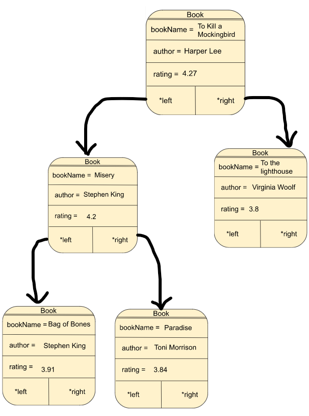
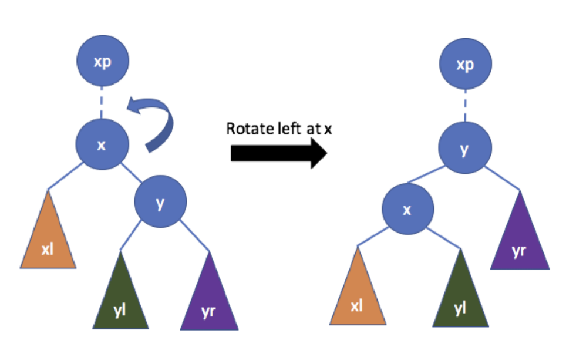
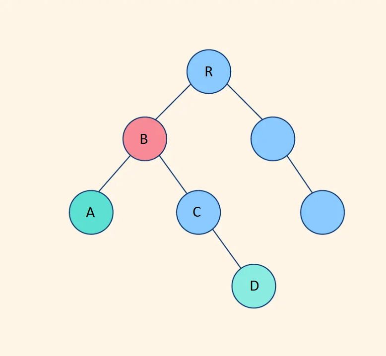

# CSCI 2270 – Data Structures - Assignment 7 - Binary Search Tree II

## Objectives

1. Given a Binary Search Tree (BST) perform the following operations on it
2. Remove a book, rotate the tree and find the closest parent to two books. 

## Instructions to run programs

Please read all the directions ​*before* writing code, as this write-up contains specific requirements for how the code should be written.

To receive credit for your code, you will need to pass the necessary test cases. Use the following steps to test your code as you work on the assignment:

 1. Open up your Linux terminal, navigate to the build directory of this assignment (e.g. `cd build`).
 2. Run the `cmake ..` command.
 3. Run the `make` command.
 4. If there are no compilation errors, two executables will be generated within the build directory: `run_app` and `run_tests`.
 4. If you would like to run your program, execute `run_app` from the terminal by typing `./run_app <Any Required Arguments>`.
 5. To run the grading tests, execute `run_tests` from the terminal by typing `./run_tests`.

## Background 
<details>
  <summary>Click to expand Homework 6 specifications</summary>

Binary Search Trees (BST) are very interesting data structures. Let's break down what they mean.

    1. Tree: A tree is a hierarchical data structure. Every node has zero or more children (where each child is also a node of the tree). It starts with a root node (start of the tree) and branches out to the leaf nodes(have no children).

    
    2. Binary: While a tree node can have any number of children, making it binary restricts the children to atmost 2. (So a node in a binary tree can have 0, 1 or 2 children only)


    3. Search: This is what makes a BST unique. BSTs have some rules in place which allow us to 'search' faster in our tree data structure. Let's look at these rules which must be honored by every node of a BST.
    (a) Each BST node must be associated with a key. This key could be an integer, string, float, etc.
    (b) For each node of the BST, ALL nodes in the left subtree must have key 'lesser' than the key of the node.
    (c) For each node of the BST, ALL nodes in the right subtree must have key 'greater' than the key of the node.
    (d) For this assignment, no two books have the same `bookName`.


 ## Overview
 
 In this assignment, you should store the information of some books in a binary search tree. For each book, we will store its name, author, and rating. A sample dataset from [Goodreads](https://www.goodreads.com/) has been given in `books.csv`. This is the definition of the `Book` struct in `BookCollection.hpp`:
```
 struct Book {
    string bookName;
    string author;
    double rating;

    Book* left = nullptr;
    Book* right = nullptr;
};
```
The tree is such that all the children of a node on its left child's subtree have `bookName` alphabetically `smaller` than the parent node. Similarly, the children on the right subtree are alphabetically `larger`.

You can use the `books.csv` file to test the functions, but you can run the program without it as well. If you want to use the dataset, simply add `../books.csv` as an argument to `run_app`. You don't need to do this, and simply running it without any arguments will also work, but will start with an empty collection. 

Here are a few entries from the dataset:


| Name | Author | Rating
| --- | --- | --- |
| To Kill a Mockingbird | Harper Lee | 4.27 |
| Misery | Stephen King | 4.2 |
| To the Lighthouse | Virginia Woolf | 3.8 |
| Paradise | Toni Morrison | 3.84 |
| Bag of Bones | Stephen King | 3.91 |

If we add these items in the given order, the tree should be as follows: 

```Example 1```



**NOTE:** `app/main.cpp` file has been provided for you. Do NOT make any changes to the `app/main.cpp` file. Along with main.cpp, the following functions present in the previous assingment (assignment 6) will also be provided to you in a library (you *don't* need to implement them). 

### Constructor: BookCollection()
Class constructor. Set the root of the tree to a `nullptr`.

### Destructor: ~BookCollection()
Class destructor. Free all memory that was allocated and set root to `nullptr`. 

For any book present in the collection, you need to recursively delete both the children and only then delete the current book. If you delete the current book first, `book->left` and `book->right` will become inaccessible.

### void addBook(string bookName, string author, double rating)

This function will add a new book to the collection based on the `bookName`, `author` and `rating`. It will take these three values as parameter from command line and add a book to the collection.  

### showBookCollection() 

Show all the books added to the collection so far, in alphabetical order.  If the collection is empty, it will print `"Collection is empty."`

### void showBook(string bookName)

In the `BookCollection`, this function will search for a `bookName` matching the given `bookName`. If the book is found, it will display its properties like:

```
cout << "Book:" << endl;
cout << "==================" << endl;
cout << "Name :" << book->bookName << endl;
cout << "Author :" << book->author << endl;
cout << "Rating :" << book->rating << endl;
```
If the book is not found in the collection, it will print out `"Book not found."`
</details>


## Function you will have to implement in assignment 7 

For the described setting, you will have to implement the following functions in `code/BookCollection.cpp`. You will have to create multiple helper functions to iterate through the tree (they are mentioned in the hint).


### void removeBook(string bookName)

Remove the given ```bookName``` from the book collection. You will have to take care of the following edge cases:

1. Leaf Node
2. Node having either only left or only right child
3. Node having both left and right child

#### ```Example```

Suppose in example 1 (present in the background) we want to remove the book *Paradise*. The collection before calling the function will look like:

```
BOOK: Bag of Bones BY: Stephen King RATING: 3.91
BOOK: Misery BY: Stephen King RATING: 4.2
BOOK: Paradise BY: Toni Morrison RATING: 3.84
BOOK: To Kill a Mockingbird BY: Harper Lee RATING: 4.27
BOOK: To the lighthouse BY: Virginia Woolf RATING: 3.8
```

We will call the remove function ```removeBook("Paradise");```

The updated BookCollection tree should look like

```
BOOK: Bag of Bones BY: Stephen King RATING: 3.91
BOOK: Misery BY: Stephen King RATING: 4.2
BOOK: To Kill a Mockingbird BY: Harper Lee RATING: 4.27
BOOK: To the lighthouse BY: Virginia Woolf RATING: 3.8
```


If the book is **_not present_**, then you need to print ```cout << "Book not found!" << endl;``` 

#### ``` Example ```

```removeBook("Down and Out in Paris and London");```

The output for this should be

``` "Book not found!" ```

*Hint: For this function you would want to create a helper function to find the minimum node in the right-subtree.*


### void rotateLeftCollection(string bookName)

Rotate the node with the given bookName to the left. You can refer to the given illustration. 


Rotate the node with the given bookName to the left. In the given illustration, left rotation is being performed on node x.

1. Set the Parents pointers accordingly
   - Parent of x becomes the parent of y
   - y becomes the new parent of x
2. Set the subtree (left and right children) pointers accordingly
   - The left subtree of y becomes the right subtree of x
   - x and its descendants become the left subtree of y
3. If x was the left (or right ) subtree of xp (parent of x), make y the left (or right) subtree of xp respectively. This can be checked by comparing the book names of the parent (xp) and the child (y).
4. Check the boundary conditions
   - x is root
   - x has no right child




*Hint: For this function you would want to create helper function (findParent) which returns the pointer to parent node of x (xp) and another helper function which returns the node x, so that its easy change the subtrees of nodes x, y and xp.*


### string closestParent(string book1, string book2)

Given two books you will have to find the closest common parent. 

#### ```Example```

Suppose in Example 1, you want to find the lowest/latest parent for books *Bag of Bones* and *To the lighthouse*. The closest parent for both of these books will be the root node which is *To kill a mocking bird*. The output will be **Note: The cout statement for this output is already present in main, you just have to return the parentBook**:

``` The closest parent to both the books is: To Kill a Mockingbird ```

#### ```Example```

Suppose the book you input is not present in the collection, eg: *book2 = Harry Potter*. You will print out ```cout << "Book not found!" << endl;``` and return ``` parentBook = Error - wrong book name```.

For input:
```
Enter the name of the first book (Book1):
Misery
Enter the name of the second book (Book2):
Harry Potter
```

Your output will look as follows:
```
Book not found!
The closest parent to both the books is: Error - wrong book name
```


*Hint: For this function, you would want to create helper functions that find the path to a certain bookName and store it in an array.*

In the tree below, suppose you want to find the closest parent to node A and D. For that, you need to first find the path to book1 and book2 from the root. In the illustration below, the path for A is:
```
R -> B -> A
```
and the path for D is:
```
R -> B -> C -> D
```
Once the two paths are known, we can simply look for the last element that is in both the paths, in this case B. That element will then be the closest parent. 
Note that you are only to **return the bookName** of the node and not the pointer to the node.




### Submitting your code:
Write your code and push the changes to your private repository. Log onto Canvas and go to Assignment 6. Paste your GitHub repository link and submit.

### Appendix
You will have to traverse through the collection by calling a helper function. For example, if you want to reach the leaf nodes of the trees you will implement it in the following way:

```
void BookCollection::leafNode()
{
    leafNodeHelperFunction(root);
}

void leafNodeHelperFunction(Book* currNode)
{
    if(currNode!=nullptr)
    {
        if(currNode->left == nullptr && currNode->right == nullptr)
        {
            //reached the leaf node - now you can print whatever you want and do whatever
            cout << currNode->bookName << endl; // leaf node book
            return;
        }
        // These two lines will recursively call the left and right sub-tree respectively. 
        // You can go to the bottom of the tree by calling the same function on the current nodes left and right children
        leafNodeHelperFunction(currNode->left);
        leafNodeHelperFunction(currNode->right);
    }
}
```
