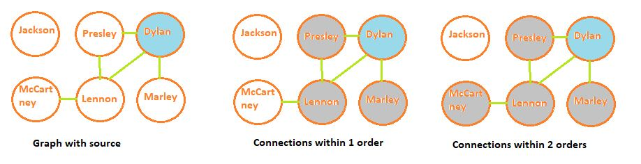

# CSCI 2270 – Data Structures - Assignment 8: Graph Part I

## Objectives

1. Applications of the Breadth First Traversal

## Instructions

Write code to apply the Breadth First Traversal. To receive credit for your code, you will need to pass the necessary test cases. Use the following steps to test your code as you work on the assignment:

 1. Open up your Linux terminal, navigate to the build directory of this assignment (e.g. `cd build`).
 2. Run the `cmake ..` command.
 3. Run the `make` command.
 4. If there are no compilation errors, two executables will be generated within the build directory: `run_app` and `run_tests`.
 5. If you would like to run your program including your app implementation in the `main` function, execute `run_app` from the terminal by typing `./run_app`.
 6. To run the grading tests, execute `run_tests` from the terminal by typing `./run_tests`. 

## Overview

In this assignment, you will apply BFT to find distances between connected vertices in an undirected graph. The linkedIn professional network will be modeled here as a graph where a professional will be a vertex in the graph and the edges will be connections between them. 

The graph will be implemented using the following struct: 

```
struct Professional;
struct neighbor {
   Professional *v;
};

struct Professional{
    string name;
    bool visited = false;
    int connectionOrder = 0;
    vector<neighbor> neighbors;
};
```

**NOTE: You are welcome to use the *main* function to test your code. The code in *main.cpp* is not being graded for this assignment.**

## Class Specifications

The **LinkedInNetwork** class definition is provided in the file `LinkedInNetwork.hpp`. Do not modify this file! Fill in the TODO implementations in file `LinkedInNetwork.cpp` according to the following specifications. 

**void addProfessional(string name);** 
+ Add new professional (i.e., a vertex) with `name` to the graph unless something with the same name exists. If a professional already exists with the same name, print out the following:
```
cout<<name<<" found."<<endl;
```

**void addConnection(string v1, string v2);** 
+ Add a connection (i.e., an edge) between professionals named `v1` and `v2`. It is guaranteed that there will be vertices with names 'v1' and 'v2' in the graph. Remember that this is an undirected graph. So if you are adding 'B' to the neighbors of 'A', then you also have to add 'A' to the neighbors of 'B'.

**void displayConnections();** 
+ Display all the edges in the graph in the following format:

If we create a graph with the following structure.

```
graph.addProfessional("Dylan");
graph.addProfessional("Jackson");
graph.addProfessional("Lennon");

graph.addConnection("Dylan", "Lennon");
graph.addConnection("Lennon", "Jackson");
```

We print the edges in the following manner.

```
Dylan --> Lennon
Jackson --> Lennon
Lennon --> Dylan Jackson
```

The order of vertices printed is the same as the order in which they were added to the linkedIn network. Similarly, the order of vertices to the right of `-->` sign is the same as the order in which the
corresponding edge was added to the graph (e.g., notice the list of professional connections added for Lennon:  Dylan is printed first, since that connection was added to the network first).

**void breadthFirstTraverse(string sourceProfessional);**
+ Breadth first traversal from `sourceProfessional`. Format for printing:

```
// for the source vertex in the network
cout << "Starting Professional (root): " << sourceProfessional << "-> ";
// for other professional vertex traversed from source professional vertex which is are various connectionOrders
cout << n->neighbors[x].v->name <<"("<< n->neighbors[x].v->connectionOrder <<")"<< " ";
```

A vertex with name 'sourceProfessional' is guaranteed to exist in the graph.
If we create a graph like following:

```
graph.addProfessional("Jackson");
graph.addProfessional("Marley");
graph.addProfessional("Presley");
graph.addProfessional("Dylan");
graph.addProfessional("Lennon");
graph.addProfessional("McCartney");

graph.addConnection("Marley", "Dylan");
graph.addConnection("Dylan", "Lennon");
graph.addConnection("McCartney","Lennon");
graph.addConnection("Lennon","Presley");
graph.addConnection("Presley","Dylan");
```

Your output would look something like this when the source is Marley:

```
Starting Professional (root): Marley-> Dylan(1) Lennon(2) Presley(2) McCartney(3) 
```

Observe that Lennon precedes Presley as it was connected to Dylan earlier.

**vector<string> suggestProfessionalsWithinKthOrder(string professionalName, int k);**
+ Imagine that `professionalName` has joined linkedIn recently, and have added a few connections. Therefore, to increase activity (i.e., sending a direct message to his connections and/or send new connection requests), the linkedIn platform wants to show all the professionals who `professionalName` might know. This function returns the list of professionals who are a maximum of `K`th order of connection from `professionalName`. The order of the names of vertices is the same as the order in which they were added to the linkedIn network.

**NOTE**: You should create a separate copy of breadthFirstTraverse as a helper function that does not use include cout statements. If you call breadthFirstTraverse inside this function, you will fail the autograded tests.

Note that for every test run, we make a new graph entirely. So there is no need to reset the visited booleans to false or the conectionOrders to zero. 

Considering the following linkedIn network, we have **Dylan** as the `professionalName`, coloured in *blue*, and the professionals who are within the `K`th ordered connections coloured in *gray*. 



  

### Order of function implementation

1. addProfessional
2. addConnection and displayConnections
3. breadthFirstTraverse
4. suggestProfessionalsWithinKthOrder
