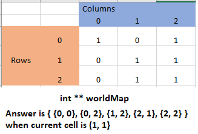
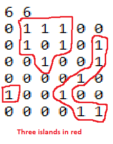

# CSCI 2270 – Data Structures - Assignment 9: Graph Part II

## Objectives

1. Applications of the Depth First Traversal

## Instructions

Write code to apply the Depth First Traversal. To receive credit for your code, you will need to pass the necessary test cases. Use the following steps to test your code as you work on the assignment:

 1. Open up your Linux terminal, navigate to the build directory of this assignment (e.g. `cd build`).
 2. Run the `cmake ..` command.
 3. Run the `make` command.
 4. If there are no compilation errors, two executables will be generated within the build directory: `run_app` and `run_tests`.
 5. If you would like to run your program including your app implementation in the `main` function, execute `run_app` from the terminal by typing `./run_app`.
 6. To run the grading tests, execute `run_tests` from the terminal by typing `./run_tests`. 

## Overview

In this assignment, you will import a 2D array from a text file and turn it into a worldMap with Region vertices and respective neighbor vectors. This will entail setting up the Regions, assigning neighbors to each respective neighbors vector, and completing a Depth First Traversal problem where you need to identify the number of islands in the region. 

The graph will be implemented using the following struct: 

```
struct NeighboringRegion {
    Region *region;
};

struct Region {
    int x;
    int y;
    bool visited = false;
    vector <NeighboringRegion> neighbors;
};
```

**NOTE: You are welcome to use the *main* function to test your code. The code in *main.cpp* is not being graded for this assignment.**

## Class Specifications

The **WorldMap** class definition is provided in the file `worldMap.hpp`. 

**void createWorldMap(string fileName);**
+ Import the .txt file (example is in the main folder) and make a worldMap (private int** worldMap; provided in .hpp file) using the information provided. The first line if the text file will contain the dimensions of the map, to be stored in int rows, cols (also in .hpp); the rest of the file will show each value in the map. 1s represent land regions, 0s represent empty space between them. getline and stringstream functions are very useful here. We are just creating and populating the int** worldMap from the text file whose first line gives the size values. When filling the worldMap, make sure to fill the rows and columns in the increasing order i.e., fill all columns of row 0 first, then all columns of row 1 and so on.

*There is an image at the end of Readme for visualization.*
*Remember, an int\*\* can be accessed the way a 2D array can (worldMap[i][j])*
*Tests for `createWorldMap` use `printWorldMap`. So please finish both functions before running tests.*

**void printWorldMap();**
+ This will print the world map out using cout. Here is an example of what a sample 3x3 map will look like: 
```
| 1 | 0 | 0 |
| 0 | 1 | 0 |
| 0 | 0 | 1 |
```


**void addRegion(int x, int y);** 
+ Create a new Region with the position (x,y) and add it to the `regions` of the WorldMap class, unless one already exists. There is no need to print anything out if a region with same x and y already exists in regions, just return without creating a Region. There is no need to touch the int **worldMap here.

**void addEdgeBetweenRegions(int x1, int y1, int x2, int y2);** 
+ If an edge doesn't already exist between the positions (x1, y1) and (x2, y2), add one. Remember that this is an undirected graph. So, when you add `A` as a neighbor to `B`, you should also add `B` as a neighbor to `A`. You don't need to print anything if an edge already exists. 
+ To check if an edge already exists, create a helper function that iterates through all the neighbors of the region corresponding to (x1, y1) and verify if you find (x2, y2) in those.
+ If either of the regions with (x1, y1) or (x2, y2) is not found, do nothing.


**vector<vector<int>> findAdjacentLandRegions(int x, int y);**
+ This function will use the int **worldMap to find the current x,y location's neighbors. Check the 8 surrounding spaces (directions NW, N, NE, W, E, SW, S, SE in the same order) to see if they are land regions (where the worldMap[i][j] is equal to 1) and add the vector containing `i` and `j`(a simple {i, j} will do) to the answer(which is a vector of vectors) that must be returned.
+ Make sure the get the order of spaces correct. You simply need to iterate in an increasing order for both rows and columns i.e., check the 3 spaces in the row above the cell from left to right, then in the row of the current cell check the left and the right cells(notice current cell is not included), then finally the 3 spaces in the row below the cell from left to right. Look at the image for help.


        
        
**void convertWorldMapToAdjacencyListGraph();**
This function uses the last three functions you created to make the AdjacencyListGraph. 

+ For each (x,y) location in the worldMap, do the following: 
    + Use addRegion to create a Region at the current location, only if the value at this location is 1

+ After the regions are created, have another set of nested for loops for each (x,y) location in the worldMap, to do the following only if the value of the location is 1: 
    + Use findAdjacentLandRegions to find all land neighbors of the current location.
    + Iterate through all of those neighbors to add an edge between the current location and each of the neighbor locations. (Use addEdgeBetweenRegions for edge additions)


**~WorldMap();**
+ Destructor for the class. Delete all private variables and make sure you are not leaking memory.


**void displayEdges();**
+ Display all edges in the worldMap. The format for printing out the neighbors is as follows:
```
(1,1) --> (1,2) (2,1)
(1,2) --> (1,1) (2,1)
(2,1) --> (1,1) (1,2)
```

The following couts might be useful:
+ `cout<<"("<<regions[i]->x<<','<<regions[i]->y<<")"<<" --> ";`
+ `cout<<"("<<regions[i]->neighbors[j].region->x<<','<<regions[i]->neighbors[j].region->y<<")"<<" ";`
+ Simply looping through the regions vector of the WorldMap class, and at each region, looping through the neighbors from first to last will give you the correct printing order here.
        
**int findNumOfIslands();**
+ This function will use Depth First Traverse to find the count of clusters of land regions, or islands, in the WorldMap class. You should iterate through the vector `regions` from WorldMap class and, at each unvisited Region you find, run a Depth First Traversal helper to visit all individual Regions of the current island. Return the number of islands that you find.

**NOTE**: Each time you run DFS on a Region, you will fully visit all Regions in that island. Remember to mark each Region as visited as you traverse! 

Use the following cout statement in your depth first traversal helper when you visit a region for the first time (this is not used for testing, but is useful for debugging):
+ `cout << "Reached vertex: "<<"("<<r->x<<','<<r->y<<")"<<endl; `



### Order of function implementation

As listed here in the README. 
